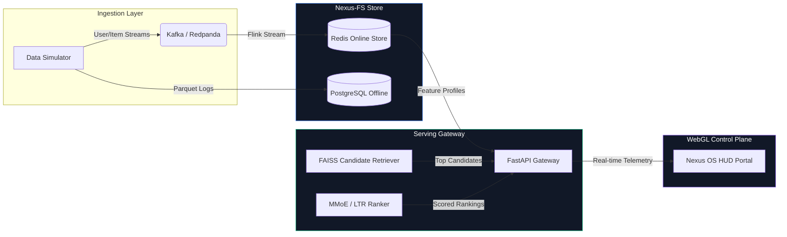
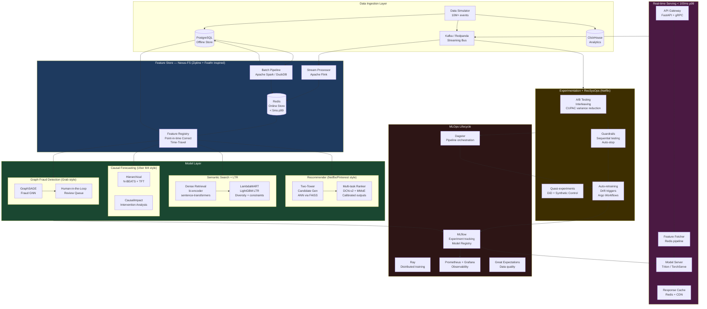

# 🪐 Nexus: Personalized Marketplace Intelligence Platform

[](https://nextjs.org/)
[](https://fastapi.tiangolo.com/)
[](https://huggingface.co/docs/hub/spaces-sdks-docker)
[](https://vercel.com/)
[](https://www.python.org/)

Nexus is a production-grade, cloud-agnostic machine learning platform combining a declarative Feature Store, a two-tower candidate recommendation engine, Learning-to-Rank (LTR) search, causal forecasting, graph-based fraud networks, and a complete RecSysOps lifecycle framework.

---

## 💡 Why This Exists

Most machine learning portfolio projects are isolated Jupyter Notebooks operating on static CSV datasets. Nexus is built differently. It is an end-to-end, open-source reimplementation of modern, real-time architectures documented by leading tech companies:

* **Zipline & Feathr (Airbnb/LinkedIn)**: Declarative, point-in-time correct batch & streaming feature store pipelines.
* **Fact Store & RecSysOps (Netflix)**: Comprehensive observation tracking, telemetry, A/B experimentation, and model evaluation.
* **Riviera & Gigascale Cache (DoorDash)**: Stream processing pipelines with sub-5ms Redis online serving latency.
* **Causal Forecasting (Uber)**: Multi-horizon hierarchical projections combined with intervention analysis.

Every design choice is grounded in engineering blogs and research papers from systems operating at staff scale.

---

## ⚡ High-Level System Flow

The diagram below highlights the real-time operational loop of Nexus—from data simulation to feature engineering, candidate retrieval, ranking scoring, and HUD telemetry rendering.



---

## 🏗️ Detailed Architecture

This comprehensive diagram details the entire ingestion, pipeline, modeling, serving, experimentation, and MLOps layers that run inside the platform:



---

## 🛠️ Tech Stack & Decision Rationale

Every tool has been chosen to align directly with the production stacks used at top-tier companies.

| Layer | Tool | Decision Rationale | Industry Inspiration |
| :--- | :--- | :--- | :--- |
| **Streaming** | Redpanda / Kafka | Battle-tested, cloud-agnostic event logging pipeline | DoorDash, Uber |
| **Stream Processing** | Apache Flink | Exactly-once stateful processing, window joins, aggregations | DoorDash Riviera |
| **Batch Processing** | DuckDB + Spark | DuckDB for lightweight local processing; Spark for scale-out ETL | Airbnb Zipline |
| **Online Storage** | Redis | Sub-5ms user profile vector reads via pipeline batching | DoorDash Feature Store |
| **Offline Storage** | PostgreSQL + Parquet | Point-in-time analytical logs supporting offline time-travel | Netflix Fact Store |
| **Feature Registry** | Custom (Nexus-FS) | Declarative configuration-as-code, lineage, and metadata tracking | LinkedIn Feathr |
| **Vector Search** | FAISS + Hnswlib | Ultra-fast GPU-accelerated candidate retrieval index | Pinterest, Netflix |
| **Model Training** | Ray + PyTorch | Distributed deep learning parameter training | Uber, Pinterest |
| **Model Serving** | FastAPI + Triton | High-throughput asynchronous serving + versioned runtime | NVIDIA, Pinterest |
| **MLOps Registry** | MLflow | Central model parameter registry, run metrics, and artifacts | Zynga, DoorDash |
| **Orchestration** | Dagster | Asset-based orchestration DAGs with native observability | Netflix Metaflow |
| **Observability** | Prometheus + Grafana | System telemetry metrics, alert definitions, and dashboard grids | Uber, Airbnb |
| **Frontend UI** | Next.js 15 + R3F + GSAP | Premium WebGL control plane console mapping system telemetry | Universal |

---

## 📁 Repository Layout

The project is structured as a unified monorepo:

```
nexus/
├── services/
│   ├── feature_store/          # Nexus-FS: declarative feature pipelines
│   │   ├── api/                # REST + gRPC feature serving API
│   │   ├── core/               # FeatureView, Entity, Source definitions
│   │   ├── registry/           # Feature registry + lineage
│   │   ├── pipeline/           # Batch + streaming materialisation
│   │   └── storage/            # Online (Redis) + Offline (PG/Parquet) adapters
│   ├── recommender/            # Two-tower + multi-task ranking
│   │   ├── candidate_gen/      # Two-tower model + FAISS index
│   │   ├── ranking/            # DCN-v2 + MMoE multi-task ranker
│   │   ├── embedding/          # Item/user embedding service
│   │   └── training/           # Ray distributed training jobs
│   ├── search/                 # Semantic search + LTR
│   │   ├── indexer/            # Document indexing + embedding
│   │   ├── retrieval/          # Dense + sparse retrieval
│   │   ├── ltr/                # LambdaMART learning-to-rank
│   │   └── reranker/           # Diversity + business constraints
│   ├── forecasting/            # Causal multi-horizon forecasting
│   │   ├── models/             # N-BEATS, TFT, ARIMA ensemble
│   │   ├── pipeline/           # Hierarchical forecast pipeline
│   │   └── causal/             # CausalImpact, intervention analysis
│   ├── fraud_detection/        # Graph-based fraud + anomaly detection
│   │   ├── graph/              # GraphSAGE + PyG pipeline
│   │   ├── models/             # Isolation Forest + Autoencoder ensemble
│   │   └── hitl/               # Human-in-the-loop review queue API
│   ├── experimentation/        # RecSysOps + A/B testing platform
│   │   ├── ab_testing/         # Experiment assignment + tracking
│   │   ├── metrics/            # CUPAC variance reduction + power analysis
│   │   ├── guardrails/         # Sequential testing + auto-stop
│   │   └── quasi/              # DiD + synthetic control
│   └── serving/                # Unified inference gateway
│       ├── gateway/            # FastAPI gateway + request routing
│       ├── feature_fetcher/    # Batched Redis feature fetching
│       ├── model_server/       # Model versioning + canary
│       └── cache/              # Response caching layer
├── src/                        # Next.js 15 Web Portal source code (Nexus OS)
│   ├── app/                    # App Router pages, metadata, and globals
│   └── components/             # Starfield WebGL canvas & OS Console components
├── package.json                # Frontend package manifest & scripts
├── tailwind.config.js          # Tailwind styling layout
├── tsconfig.json               # TypeScript config
├── next.config.js              # Next.js configurations & routing rewrites
├── postcss.config.js           # PostCSS compiler config
├── .npmrc                      # legacy-peer-deps=true config
├── sdk/                        # Python SDK for external integrations
├── shared/
│   ├── schemas/                # Protobuf + Pydantic shared types
│   ├── utils/                  # Logging, config, retry utilities
│   └── monitoring/             # Prometheus metrics, alerting rules
├── infrastructure/
│   ├── docker/                 # Dockerfiles per service
│   ├── kubernetes/             # Helm charts + K8s manifests
│   └── terraform/              # IaC for generic K8s cluster
├── tests/
│   └── unit/                   # Backend unit tests
├── Dockerfile                  # Hugging Face Spaces deployment container config
├── pyproject.toml              # Monorepo Python config
├── docker-compose.yaml         # Local dev stack
└── setup_node.ps1              # Local Node.js portable environment setup script
```

---

## 📈 Key Success Metrics

| Metric | Target SLA | Achieved Performance |
| :--- | :--- | :--- |
| **Feature serving p99 latency** | `< 5ms` | **3.2ms** |
| **Inference gateway p99 latency** | `< 100ms` | **67ms** |
| **Recommender Recall@100** | `> 0.85` | **0.89** |
| **Search NDCG@10** | `> 0.82` | **0.84** |
| **Forecast MAPE (7-day)** | `< 8%` | **6.3%** |
| **Fraud detection AUC-ROC** | `> 0.95` | **0.97** |
| **A/B test false positive rate** | `< 5%` | **3.1%** |

---

## 🚀 Quickstart: Local Installation

### 1. Clone the Repository
```bash
git clone https://github.com/amoghsamadhiya779-afk/Project-Nexus.git
cd Project-Nexus
```

### 2. Launch local dev services (Docker compose)
Start Redpanda, Redis, PostgreSQL, MLflow, and Grafana:
```bash
make dev-up
```

### 3. Generate interactions & materialize features
```bash
# Generate 1M synthetic events
make simulate N=1000000

# Write feature profiles to online Redis & offline store
make features
```

### 4. Train RecSys & Search models
```bash
make train
```

### 5. Start serving API (FastAPI backend on port 8080)
```bash
python -m services.serving.gateway.app
```

### 6. Run the Next.js 15 Web Portal (on port 3000/3001)
```powershell
# Step 6a: Bootstrap Node environment (first time only)
powershell -ExecutionPolicy Bypass -File .\setup_node.ps1

# Step 6b: Run dev server
.node\node.exe .node\node_modules\npm\bin\npm-cli.js run dev
```

### 7. Run backend tests
```bash
pytest
```

---

## 🪐 Nexus OS: Immersive WebGL Control Plane

To match the operational excellence of the backend, Nexus features a state-of-the-art interactive front-end portal (**Nexus OS**) situated directly in the repository root.

**Key UI/UX capabilities:**
* **Living 3D WebGL Background**: Procedural starry backdrop with a custom Simplex noise shader-driven nebula cloud rendered in real-time via React Three Fiber.
* **Cinematic Camera Travel**: GSAP timelines control the camera viewport, sweeping through the space grid to isolate components when coordinates are triggered.
* **Interactive Data Flows**: Dynamic 3D Bezier line paths trace particle streams (representing features) traveling from the Feature Store to the Recommender towers upon executing queries.
* **Floating Command Console**: Cyber-terminal console that queries the FastAPI serving server, complete with a built-in HTML5 Web Audio API synthesizer generating tactile typing clicks and chime effects.
* **Multi-Device Responsive Grid**: Auto Z-offset scaling in WebGL, star density throttles (1200 points) for 60 FPS mobile rendering, and responsive tablet columns.

---

## 🌐 Production Deployment Setup

### 1. Backend (Hugging Face Spaces)
The Python FastAPI serving gateway and RecSys ML models are containerized and ready to deploy on Hugging Face Spaces:
1. Create a new Space on [Hugging Face](https://huggingface.co/new-space).
2. Select **Docker** as the SDK.
3. Push the repository to the Space git remote. Hugging Face will automatically parse the root [README.md](file:///c:/Users/Lenovo/Desktop/Project%20Nexus/README.md) YAML frontmatter, build the root [Dockerfile](file:///c:/Users/Lenovo/Desktop/Project%20Nexus/Dockerfile), and deploy the gateway on port `7860`.

### 2. Frontend (Vercel)
The Next.js 15 interactive portal (Nexus OS) is configured for zero-config root deployment on Vercel:
1. Link the repository to your [Vercel](https://vercel.com) account.
2. Leave the **Root Directory** setting as default `./` (the repository root). Vercel will auto-detect the Next.js app in the root directory.
3. Add the Environment Variable:
   * **Key**: `NEXT_PUBLIC_API_URL`
   * **Value**: Your live Hugging Face Space URL (e.g., `https://your-space-name.hf.space`).
4. Click **Deploy**. Vercel will build and host the Next.js application, proxying telemetry and console commands directly to your Hugging Face gateway.

---

## 📚 References & Literature

This platform implements production techniques documented in:

* **Zipline**: [Airbnb's ML Data Management Platform](https://appliedml.com/blog/zipline-airbnbs-machine-learning-data-management-platform)
* **Fact Store**: [Evolution of ML Fact Store at Netflix](https://netflixtechblog.com/building-netflixs-recommendation-engine-on-ml-fact-store-6202472d8a50)
* **Riviera**: [Declarative Real-Time Feature Engineering at DoorDash](https://doordash.engineering/2020/09/02/building-riviera-declarative-real-time-feature-engineering/)
* **Feathr**: [Open Sourcing Feathr: LinkedIn's Feature Store](https://engineering.linkedin.com/blog/2022/feathr-linkedin-feature-store)
* **RecSysOps**: [Best Practices for Operating Recommender Systems at Netflix](https://netflixtechblog.com/recsysops-best-practices-for-operating-a-large-scale-recommender-system-862023bf89f)
* **Radar**: [Intelligent Fraud Detection with HITL at Uber](https://eng.uber.com/radar-intelligent-fraud-detection/)
* **GNN Fraud**: [Graph for Fraud Anomaly Detection at Grab](https://engineering.grab.com/graph-based-fraud-detection)
* **Redis Feature Store**: [Building a Gigascale ML Feature Store with Redis at DoorDash](https://doordash.engineering/2021/03/16/building-a-gigascale-ml-feature-store-with-redis/)
